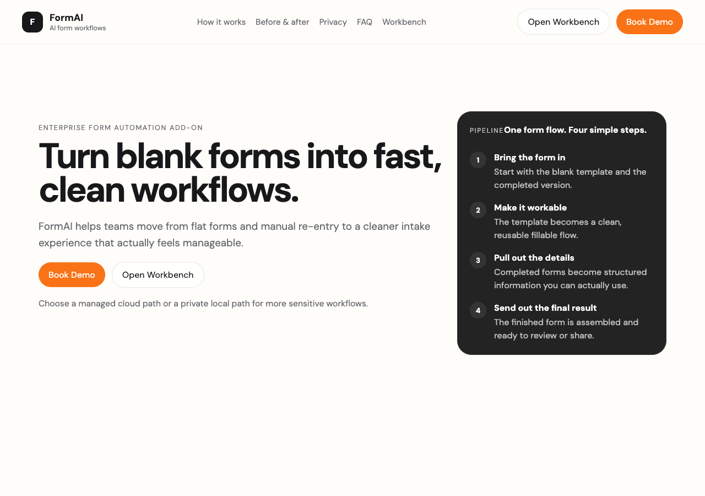
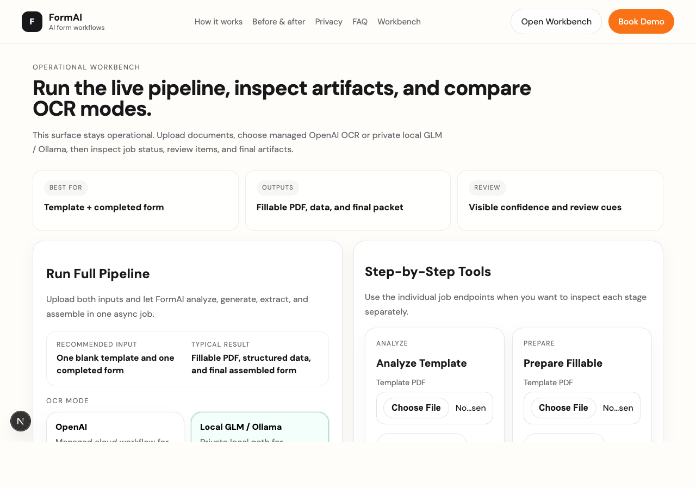

# FormAI

FormAI, kurumların elindeki statik PDF formlarını yeniden tasarlamadan daha kullanılabilir bir akışa çevirmek için geliştirilen bir form otomasyon sistemidir.

Temel hedef:
- boş form şablonunu doldurulabilir AcroForm PDF'e dönüştürmek
- dolu form PDF veya görsellerinden yapılandırılmış veri çıkarmak
- gerekiyorsa aynı veriyi hedef şablona geri basıp son PDF üretmek
- bütün bunları hem local/private hem managed-cloud yollarıyla sunmak

Bu repo artık tek bir "demo script" değil; çekirdek Python pipeline, benchmark katmanı, FastAPI servis yüzeyi ve Next.js workbench/marketing web uygulamasını birlikte barındıran bir monorepo'dur.

## Ekran Görüntüleri

| Marketing Site | Workbench |
|---|---|
|  |  |

## Hızlı Durum

- Monorepo sürümü: `0.2.0`
- Python testleri: proje Python `3.11` ortamı ve opsiyonel bağımlılıklar kurulduktan sonra çalıştırılmalıdır.
- Web build: `Next.js` workbench offline-safe olacak şekilde tasarlanmıştır.
- Varsayılan provider yaklaşımı: `auto` / local-first
- Mevcut en kritik kalite alanı: Türkçe petition ve genel coordinate/placement güvenilirliği

## Önce Burayı Oku

- Genel giriş: [docs/README.md](docs/README.md)
- Projenin neyi çözmek istediği: [docs/overview.md](docs/overview.md)
- Ürün vizyonu: [docs/product/vision.md](docs/product/vision.md)
- Sistem mimarisi: [docs/architecture/system-overview.md](docs/architecture/system-overview.md)
- Statik PDF -> AcroForm pipeline: [docs/architecture/pdf-pipeline.md](docs/architecture/pdf-pipeline.md)
- Bugünkü gerçek kalite durumu: [docs/quality/current-state.md](docs/quality/current-state.md)
- Dataset ve benchmark mantığı: [docs/quality/datasets-and-benchmarks.md](docs/quality/datasets-and-benchmarks.md)
- API ve job modeli: [docs/api-and-jobs.md](docs/api-and-jobs.md)
- Web uygulaması: [docs/web/overview.md](docs/web/overview.md)
- Release, sürümleme ve arşiv politikası: [docs/operations/release-and-archive.md](docs/operations/release-and-archive.md)
- 0.2.0 release manifest: [docs/releases/0.2.0/manifest.md](docs/releases/0.2.0/manifest.md)
- Checkpoint geçmişi: [checkpoints/INDEX.md](checkpoints/INDEX.md)

## Kısa Kurulum

Python core:

```bash
/opt/homebrew/bin/python3.11 -m venv .venv311
source .venv311/bin/activate
pip install -e ".[vision,glm_ocr,commonforms,benchmarks,api,dev]"
```

Web:

```bash
cd web
npm install
npm run build
```

## Sık Kullanılan Komutlar

Analiz:

```bash
PYTHONPATH=src ./.venv311/bin/python -m formai.cli analyze --template ./template.pdf
```

Fillable hazırlama:

```bash
formai prepare-fillable --template ./template.pdf --output ./template.fillable.pdf
```

Uçtan uca pipeline:

```bash
formai run \
  --template ./template.pdf \
  --filled ./filled-form.pdf \
  --fillable-output ./template.fillable.pdf \
  --final-output ./final.pdf
```

Test:

```bash
env PYTHONPATH=src ./.venv311/bin/python -m unittest discover -s tests -v
```

API:

```bash
uvicorn formai.api:create_app --factory --reload
```

Web:

```bash
cd web
npm run dev
```

## Runtime Notları

- Provider seçimi artık `openai` varsayımıyla başlamaz. Kod tarafında default `auto`'dur.
- `auto`, önce yerel provider'ları (özellikle Ollama) dener; uygun ortam yoksa OpenAI key varsa OpenAI'a geçer.
- Web katmanı `next/font/local` kullandığı için `npm run build` ağ erişimi olmadan da deterministik şekilde çalışır.
- Türkçe ve çok dilli nihai kullanıcı çıktısı için fillable PDF ile final render ayrıdır:
  - `fillable.pdf`: interaktif AcroForm çıktı
  - `final.pdf`: kullanıcıya gösterilen, Unicode-safe overlay ile üretilen çıktı

## Repo Yapısı

```text
src/          Python ürün kodu
tests/        Unit + integration testleri
scripts/      Operasyon ve doğrulama scriptleri
web/          Next.js marketing site + workbench
docs/         Ana bilgi kaynağı
checkpoints/  Manifest-first tarihsel checkpoint kayıtları
tmp/          Yerel çalışma artefact alanı (source of truth değildir)
```

## Önemli Not

Bu repo şu an "yüksek potansiyelli ama hâlâ sertleştirilen" bir ürün adayıdır. Özellikle Türkçe gerçek petition/form case'lerinde extraction ve visual verification ilerlemiş olsa da henüz tam release-ready kabul edilmemektedir. Bunun dürüst durumu [docs/quality/current-state.md](docs/quality/current-state.md) içinde yer alır.
